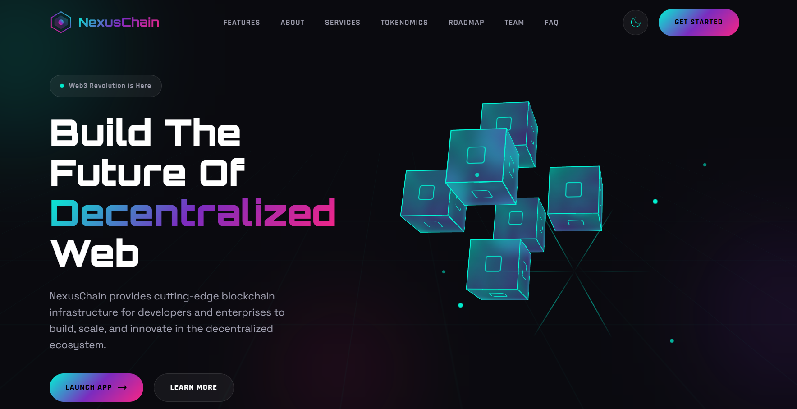

# 🌐 Omkar R. Ghare — MetaChain 3D Web3 Landing (v7)

An ultra-futuristic **3D Web3 startup landing page** featuring immersive visuals and advanced UI styling.

---

## 🚀 Live Demo  
🔗 https://omkarghare8.github.io/web3-blockchain-landing-page-template-v7/

---

## ✨ Features

- 3D visual sections  
- Animated backgrounds  
- Futuristic UI layout  
- Responsive design  
- Startup-ready sections  

---

## 🛠 Tech Stack

- HTML5  
- CSS3  
- JavaScript  

---

## 📸 Preview

---

## 🎯 Purpose of This Project

To explore advanced 3D-inspired Web3 design and enhance modern UI implementation skills.

---

## 👨‍💻 Author

**Omkar R. Ghare**
